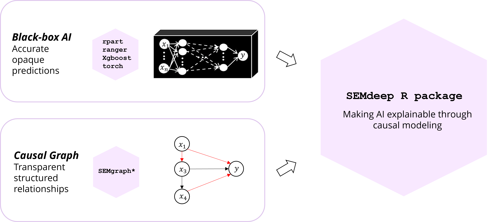
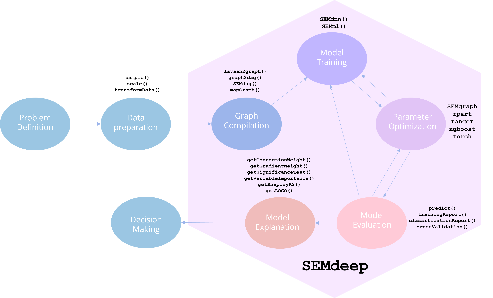
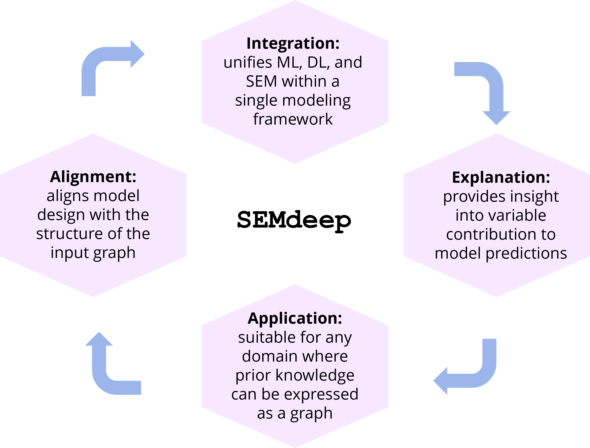

# SEMdeep

## Overview

SEMdeep provides an integrated framework to train, validate, and explain Structural Equation Models (SEMs) using deep neural network (DNN) and machine learning (ML) algorithms. It combines the strengths of causal inference and predictive modeling to build interpretable systems that remain faithful to a given graph structure.

The package is fully compatible with SEMgraph, which defines and manipulates causal graphs. Together, the two packages form a dual modular system:

- **SEMgraph**: linear SEM fitting, graph model search, and topological representation.
- **SEMdeep**: SEM-based DNN and ML fitting, model evaluation, and explainability.

## Scientific Rationale and Added Value

While most machine learning models achieve strong predictive performance, they often obscure the causal structure underlying the data. SEMdeep extends the classical SEM paradigm by embedding ML and DNN algorithms directly within the causal graph, thus providing:

- Data-driven estimation aligned with prior causal structure;
- Model interpretability through connection and gradient weights;
- Interoperability with SEMgraph for graph construction and validation.

This integration allows the user to move seamlessly from causal discovery to explainable predictive modeling.



## Conceptual Workflow

The conceptual workflow follows a modular and interoperable design:

1. **Data preprocessing** – sampling, scaling, and feature selection.
2. **Graph compilation** – conversion of DAGs or SEM specifications to adjacency matrices using SEMgraph.
3. **Model training** – graph-aligned machine learning or deep neural network fitting via `SEMml()` and `SEMdnn()`.
4. **Parameter optimization** – hyperparameter tuning and regularization across models.
5. **Model evaluation** – predictive accuracy and goodness-of-fit metrics.
6. **Model explanation** – quantitative and visual interpretation of causal effects.

All preprocessing and graph compilation steps are handled by SEMgraph, while model training, optimization, and explainability modules are managed internally by SEMdeep.



## Modeling Framework

### Input

SEMdeep operates on two main inputs:

- A data matrix, containing observed or simulated variables.
- A directed graph (adjacency matrix) that encodes the hypothesized or data-driven causal relationships among variables.

These inputs define the structural dependencies that guide model compilation, training, and explanation.

### Modeling Strategies

#### `SEMml()`

`SEMml()` performs machine learning–based SEM fitting through a nodewise approach. Each node with incoming edges is modeled as a function of its direct parents, resulting in a set of independent predictive models aligned with the directed graph.

The algorithm supports four machine learning modes:

| Algorithm | Model Type | Description | Reference |
|-----------|------------|-------------|-----------|
| `sem` | Linear SEM | Classical structural model using the `SEMrun()` function of SEMgraph. | Grassi, Palluzzi & Tarantino (2022) |
| `tree` | CART | Decision-tree–based model using `rpart`, suitable for non-linear dependencies. | Breiman et al. (1984) |
| `rf` | Random Forest | Ensemble tree model implemented via `ranger`, improving stability and variance reduction. | Breiman (2001) |
| `xgb` | XGBoost | Gradient-boosted decision tree via `xgboost` optimized for high-dimensional data. | Chen & Guestrin (2016) |

By mapping data onto the input graph, `SEMml()` creates a set of nodewise models based on directed causal links.

#### `SEMdnn()`

`SEMdnn()` extends this logic to deep neural networks (DNNs), supporting multiple graph-aware fitting strategies:

| Mode | Fitting Strategy | Description | Reference |
|------|------------------|-------------|-----------|
| Nodewise | Equation-by-equation | Fits one neural model per dependent variable using its direct parent nodes as predictors, following the causal edge structure. | Zheng et al. (2020) |
| Layerwise | Layer-by-layer | Trains sequential DNNs across graph layers, fitting each layer’s nodes as outputs of their upstream inputs. | Grassi & Tarantino (2025) |
| Structured | Whole-graph (masked) | Builds a Structured Neural Network with weight matrices masked to match the graph adjacency. | Chen et al. (2023) |
| NeuralGraph | Whole-graph (constrained) | Learns a Neural Graphical Model enforcing adjacency complement constraints for global causal consistency. | Shrivastava & Chajewska (2023) |

Each network is trained using `torch`, enabling efficient backpropagation, and if available, GPU acceleration. This design allows seamless transition from traditional SEMs to fully neural, graph-informed architectures.


## Output and Explainability

SEMdeep provides interpretable outputs through distinct explainability functions for both DNN and ML-based SEMs.

### DNN-based Explainability

| Function | Purpose |
|----------|---------|
| `getConnectionWeight()` | Computes the connection weights between nodes, reflecting learned causal effects. |
| `getGradientWeight()` | Evaluates sensitivity of output variables to perturbations in their causal inputs. |
| `getSignificanceTest()` | Tests statistical relevance of approximate linear weights for each causal link. |

### ML-based Explainability

| Function | Purpose |
|----------|---------|
| `getVariableImportance()` | Estimates predictor relevance for each ML nodewise model. |
| `getShapleyR2()` | Quantifies contribution of each predictor via Shapley R² decomposition. |
| `getLOCO()` | Computes “Leave-One-Covariate-Out” scores for feature impact evaluation. |

These measures allow causal-effect visualization through color-coded graphs and node importance plots, bridging predictive and structural interpretability. In addition, if argument `boot != 0` in `SEMdnn()` and `SEMml()`, Lam’s (2002) cheap bootstrapping is applied to estimate 90% confidence intervals for DNN and ML parameters.

## Integration and Applications

| Principle | Description |
|-----------|-------------|
| Integration | Combines SEM, ML, and DL within a unified framework. |
| Alignment | Aligns model training with the causal topology of the input graph. |
| Explanation | Produces quantitative and graphical interpretation of causal effects. |
| Application | Suitable for biomedical, genomic, and multi-omics studies requiring causal insight. |

Together, SEMgraph and SEMdeep provide a coherent workflow for Causal AI, connecting structural modeling with modern predictive algorithms.



## Installation

SEMdeep relies on the native R package `torch`, which supports CPU, GPU, and Apple Silicon acceleration — no Python required.

```r
# Install dependencies
install.packages("torch")
torch::install_torch()

# Install SEMdeep (CRAN release)
install.packages("SEMdeep")

# or latest development version
# remotes::install_github("BarbaraTarantino/SEMdeep")
install.packages("SEMdeep", repos = c('https://barbaratarantino.r-universe.dev', 'https://cloud.r-project.org'))
```

# Documentation

Comprehensive documentation, tutorials, and examples are available [HERE](https://barbaratarantino.github.io/SEMdeep/).


## Related Package

- **SEMgraph** — [CRAN](https://cran.r-project.org/package=SEMgraph) | [GitHub](https://github.com/fernandoPalluzzi/SEMgraph/) 

---

# Future Developments

The next module under development is **SEMdgm()** function. This extension will introduce generative deep learning architectures, including:
*Graph Autoencoders* (GAE), *Variational Autoencoders* (VAE), *Normalizing Flows* (NF), and *Generative Adversarial Networks* (GAN),
to approximate latent structures within complex systems for causal structure discovery.

The goal is to enable causally informed representation learning that enhances predictive accuracy while preserving consistency with the underlying causal graph.

Stay tuned for updates to version **1.2.0** and higher.

---

# References

1. Grassi M., Palluzzi F., and Tarantino B. (2022). **SEMgraph: An R Package for Causal Network Analysis of High-Throughput Data with Structural Equation Models.** *Bioinformatics*, 38(20), 4829–4830.  
   https://doi.org/10.1093/bioinformatics/btac567

2. Breiman L., Friedman J.H., Olshen R.A., and Stone, C.J. (1984). **Classification and Regression Trees.** Chapman and Hall/CRC.  
   https://doi.org/10.1201/9781315139470

3. Breiman L. (2001). **Random Forests.** *Machine Learning*, 45(1), 5–32.  
   https://doi.org/10.1023/A:1010933404324

4. Chen T., and Guestrin C. (2016). **XGBoost: A Scalable Tree Boosting System.** *Proceedings of the 22nd ACM SIGKDD International Conference on Knowledge Discovery and Data Mining*.  
   https://doi.org/10.1145/2939672.2939785

5. Zheng, X., Dan, C., Aragam, B., Ravikumar, P., Xing E. (2020). **Learning sparse nonparametric dags.** *International Conference on Artificial Intelligence and Statistics, PMLR*, 3414–3425.  
   https://doi.org/10.48550/arXiv.1909.13189

6. Grassi, M., Tarantino, B. (2025). **SEMdag: Fast learning of Directed Acyclic Graphs via node or layer ordering.** *PLoS ONE*, 20(1): e0317283.  
   https://doi.org/10.1371/journal.pone.0317283

7. Chen A., Shi, R.I., Gao, X., Baptista, R., Krishnan, R.G. (2023). **Structured neural networks for density estimation and causal inference.** *Advances in Neural Information Processing Systems*, 36, 66438–66450.  
   https://doi.org/10.48550/arXiv.2311.02221

8. Shrivastava, H., Chajewska, U. (2023). **Neural graphical models.** *European Conference on Symbolic and Quantitative Approaches with Uncertainty* (pp. 284–307). Springer Nature Switzerland.  
   https://doi.org/10.48550/arXiv.2210.00453

9. Lam, H. (2022). **Cheap Bootstrap for Input Uncertainty Quantification.** *Winter Simulation Conference (WSC)*, Singapore, 2318–2329.  
   https://doi.org/10.1109/WSC57314.2022.10015362

---

# Contact

**Barbara Tarantino**  
Email: barbara.tarantino00@gmail.com  
GitHub: https://github.com/BarbaraTarantino
